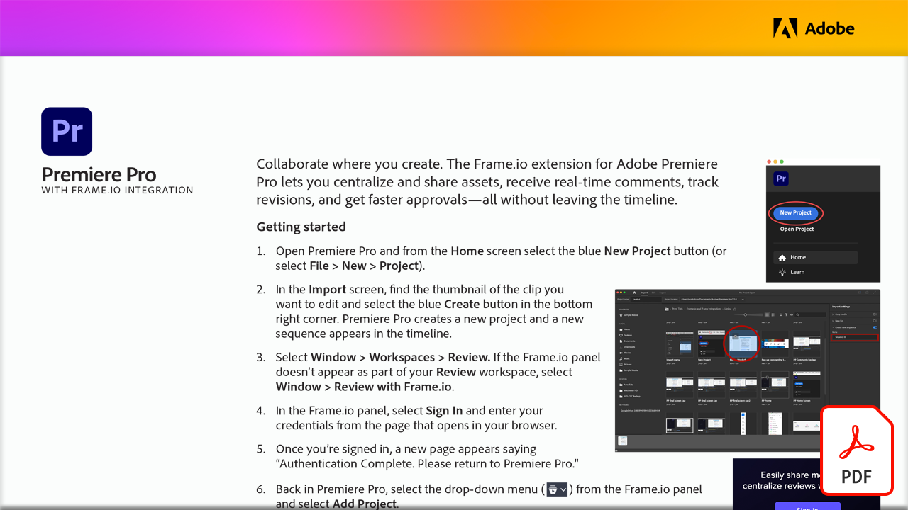

# Videogranskning med Frame.io

Samarbeta där du skapar. Lär dig hur Frame.io-tillägget för Adobe Premiere Pro gör det möjligt för dig att centralisera och dela resurser, ta emot kommentarer i realtid, spåra ändringar och få snabbare godkännanden - allt utan att du behöver lämna tidslinjen i den här praktiska självstudiekursen.

Markera bilden nedan för att visa eller hämta självstudiekursen om PDF.

{target="blank"}
