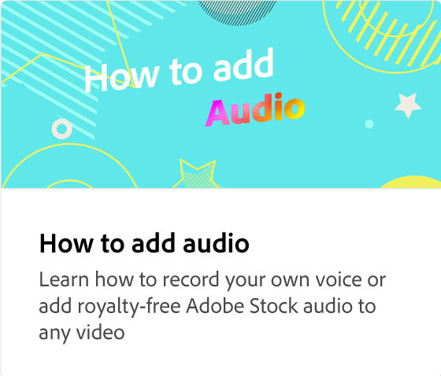

# Lägga till videoklipp

Lär dig skapa enastående videor snabbt och enkelt genom att dra och släppa. Börja med mallar eller egen statisk design och lägg till ditt varumärke, dina designresurser, Adobe Stock-videor och din musik med mera.

>[!VIDEO](https://video.tv.adobe.com/v/3436423?quality=12&learn=on&hidetitle=true&captions=swe)

## Fler videor i den här serien

<table style="table-layout:fixed">
<tr>
   <td>
         
   </td>
   <td>
         
   </td>
   <td>
         
   </td>
   <td>
         
   </td>
</tr>
<tr>
    <td>
         
   </td>
   <td>
    
    

     
   </td>
   <td>
    
    

     
   </td>
   <td>
    
    

     
   </td>
</tr>
</table>
