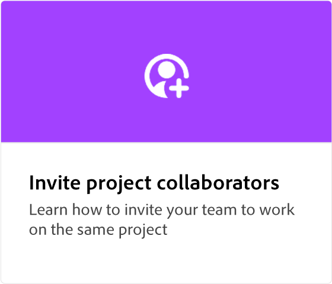

# Starta ett projekt

Lär dig hur du skapar ett helt nytt projekt från början med en specifik arbetsytestorlek, till exempel ett fyrkantigt inlägg i Instagram.

>[!VIDEO](https://video.tv.adobe.com/v/3426931?quality=12&learn=on&hidetitle=true)

## Fler videor i den här serien

<table style="table-layout:fixed">
<tr>
 <td>
      
  </td>
    <td>
      
  </td>
  <td>
      
  </td>
  <td>
      
  </td>
</tr>
<tr>
   <td>
      
  </td>
   <td>
      
  </td>
   <td>
         
   </td>
   <td>
         
   </td>
</tr>
<tr>
  <td>
   
   </td>
   <td>
   
   </td>
   <td>
   
   <td>
      
      

       
   </td>
</tr>
</table>
