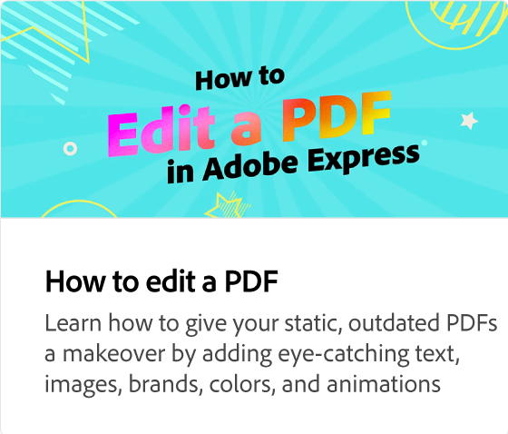

# Använda verktyget Objektsuddgummi

Lär dig radera specifika områden i bilder. Du kan också använda återställningsverktyget för att hämta tillbaka delar av bilden.

>[!VIDEO](https://video.tv.adobe.com/v/3427019?quality=12&learn=on&hidetitle=true)

## Fler videor i den här serien

<table style="table-layout:fixed">
<tr>
   <td>
         
   </td>
   <td>
         
   </td>
   <td>
         
   </td>  
   <td>
      
   </td>
</tr>
<tr>
   <td>
      
   </td>
   <td>
      
   </td>
   <td>
      
   </td>
   <td>
      
   </td>
</tr>
</table>
