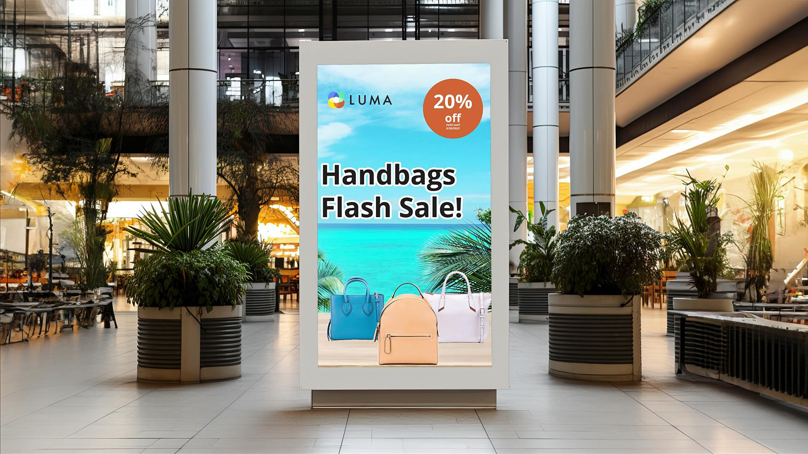

# Självstudiekurser om användningsfall för Adobe [!DNL Express]

Upptäck hur olika team i organisationen kan dra nytta av Adobe Expressen.

## Nyheter

>[!BEGINTABS]

>[!TAB Skapa flerkanaligt HR-innehåll för evenemang]

Lär dig hur du snabbt [skapar flerkanaligt HR-innehåll för evenemang](create-hr-content.md).

>[!TAB Skapa en kampanjbild för en onlinekurs]

Lär dig skapa en engagerande bild för en [onlinekurs](promo-visual.md).

>[!TAB Skapa en video i slutet av året]

Lär dig hur du skapar en inspirerande [årsslutsvideo](end-of-year-video.md).

>[!ENDTABS]

<table style="table-layout:fixed">
<tr>
   <td>
      
      

      <a href="create-hr-content.md">Skapa flerkanaligt HR-innehåll för evenemang</a>
      

      Lär dig hur du snabbt skapar flerkanaligt HR-innehåll för evenemang
       
   </td>
   <td>
      
      

      <a href="promo-visual.md">Skapa en kampanjbild för en onlinekurs</a>
      

      Lär dig skapa en engagerande bild för en onlinekurs
       
   </td>
   <td>
      
      

      <a href="end-of-year-video.md">Skapa en video i slutet av året</a>
      

      Lär dig hur du skapar en inspirerande årsslutsvideo
       
   </td>
   <td>
      
      

      <a href="newsletter.md">Skapa ett nyhetsbrev</a>
      

      Lär dig hur du skapar en dynamisk förstasida för ett nyhetsbrev
       
   </td>
</tr>
<tr>
   <td>
      
      

      <a href="create-digital-screens.md">Skapa digitala skärmmeddelanden för kontoret</a>
      

      Lär dig skapa engagerande digitala skärmmeddelanden för kontoret
       
   </td>
    <td>
      
      

      <a href="create-backgrounds.md">Skapa bakgrunder för presentationer</a>
      

      Lär dig skapa engagerande bakgrunder för PowerPoint-presentationer
       
   </td>
   <td>
      
      

      <a href="update-image.md">Uppdatera avrundningsbild för ekonomi</a>
      

      Lär dig uppdatera en statisk bild snabbt
       
   </td>
   <td>
      
      

      <a href="compelling-merchandise.md">Skapa spännande marknadsföringsmaterial</a>
      

      Lär dig skapa intressanta bilder för en ny uppsättning inventarier
       
   </td>
</tr>
<tr>
   <td>
      
      

      <a href="multi-channel-marketing-content.md">Ge marknadsföringsteam möjlighet att skapa innehåll i flera kanaler</a>
      

      Lär dig skapa unikt innehåll som lockar tittare till onlineevenemang
       
   </td>
   <td>
      
      

      <a href="localized-marketing-content.md">Ge distribuerade team möjlighet att lokalisera innehåll</a>
      

      Lär dig lokalisera innehåll för regionala marknadsföringskampanjer
       
   </td>
   <td>
      
      

      <a href="jumpstart-ideation.md">Snabbstarta kreativitetsidén</a>
      

      Lär dig hur du får ett försprång med att utveckla kreativt innehåll
       
   </td>
   <td>
      
      

      <a href="create-local-marketing.md">Skapa flygbladsinnehåll för en marknadsföringskampanj med Firefly</a>
      

      Lär dig lokalisera innehåll till en global marknadsföringskampanj
       
   </td>
</tr>
<tr>
   <td>
      
      

      <a href="create-on-boarding.md">Skapa rekryterings- och introduktionsinnehåll med Firefly</a>
      

      Lär dig skapa unik grafik för anställdas rekrytering och introduktionsinnehåll
       
   </td>
   <td>
      
      

      <a href="create-social-posters.md">Skapa affischer för sociala medier med Firefly</a>
      

      Lär dig skapa en kampanjkampanj för sociala medier på ett enkelt sätt
       
   </td>
   <td>
      
      

      <a href="create-blog-graphics.md">Skapa grafiskt innehåll för bloggar med Firefly</a>
      

      Lär dig skapa unikt grafiskt innehåll för webb-, blogg- och sociala kampanjer
       
   </td>
   <td>
      
      

      <a href="create-webinar-poster.md">Skapa affischer till webbseminarier med Firefly</a>
      

      Lär dig hur du skapar en spännande webbseminarieaffisch för ett evenemang med virtuell verklighet
       
   </td>
</tr>
</table>
