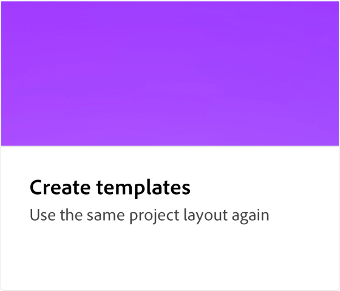

# Översikt över Adobe [!DNL Express]

Designa rullar och videor, flygblad, cv:n, banners, logotyper och annat från TikTok med den nya, allt-i-ett-appen för Adobe Express av snabbt och enkelt skapande av innehåll. Designa fantastiska verk som sticker ut med generativa AI-funktioner som drivs av Adobe Firefly.

## Nyheter

>[!BEGINTABS]

>[!TAB Enkel varumärkeskonsekvens med mallar]

Lär dig skapa varumärkesanpassat innehåll snabbt och effektivt med [mallar](use-templates.md) i hela organisationen.

>[!TAB Maximera effektiviteten: skapa återanvändbara mallar]

Lär dig hur du kan ge din organisation varumärkning, effektivitet, professionalism och kostnadsbesparingar med [mallar](create-templates.md).

>[!ENDTABS]

## Självstudiekurser för Adobe [!DNL Express]

<!-- COMMENT -->
<!-- CARDS

* https://experienceleague.adobe.com/en/docs/creative-cloud-enterprise-learn/cce-learning-hub/expressoverview/expresshowto/overview-express-how-to#getting-started
  {target = _self}
  {title = Getting started}
  {description = Learn how to navigate, use Quick actions, and explore thousands of professionally designed templates}
  {image = https://experienceleague.adobe.com/en/docs/creative-cloud-enterprise-learn/cce-learning-hub/expressoverview/media_11da3118b5b5e9240cee54d84d0a53b93a5f564d5.png?width=400&format=webply&optimize=medium}
  {cta = Browse tutorials}
* https://experienceleague.adobe.com/en/docs/creative-cloud-enterprise-learn/cce-learning-hub/expressoverview/expresshowto/overview-express-how-to#basic-tasks
  {target = _self}
  {title = Basic tasks}
  {description = Learn how to make content that really stands out}
  {image = https://experienceleague.adobe.com/en/docs/creative-cloud-enterprise-learn/cce-learning-hub/expressoverview/media_1d371d6487ef5279f42ce3392bd7c9e0449ad2e63.png?width=400&format=webply&optimize=medium}
  {cta = Browse tutorials}
* https://experienceleague.adobe.com/en/docs/creative-cloud-enterprise-learn/cce-learning-hub/expressoverview/expresshowto/overview-express-how-to#animation
  {target = _self}
  {title = Animation}
  {description = Take your content to the next level with custom animations}
  {image = https://experienceleague.adobe.com/en/docs/creative-cloud-enterprise-learn/cce-learning-hub/expressoverview/media_10ccd063d4336b984c17c2419090f01454111660c.png?width=400&format=webply&optimize=medium}
  {cta = Browse tutorials}
* https://experienceleague.adobe.com/en/docs/creative-cloud-enterprise-learn/cce-learning-hub/expressoverview/expresshowto/overview-express-how-to#advanced-tasks
  {target = _self}
  {title = Advanced tasks}
  {description = Dive deeper into Gen AI, PDF editing, and more}
  {image = https://experienceleague.adobe.com/en/docs/creative-cloud-enterprise-learn/cce-learning-hub/expressoverview/media_14ac40625ddf85c6af4a99cc2cd27732a564508eb.png?width=400&format=webply&optimize=medium}
  {cta = Browse tutorials}
* https://experienceleague.adobe.com/en/docs/creative-cloud-enterprise-learn/cce-learning-hub/expressoverview/expresshowto/overview-express-how-to#video
  {target = _self}
  {title = Video}
  {description = Video made easy. Add Adobe Stock videos and music for content that really stands out}
  {image = https://experienceleague.adobe.com/en/docs/creative-cloud-enterprise-learn/cce-learning-hub/expressoverview/media_1eee90d39e1002d4ed1ebae216c1b0603de61461b.png?width=400&format=webply&optimize=medium}
  {cta = Browse tutorials}
* https://experienceleague.adobe.com/en/docs/creative-cloud-enterprise-learn/cce-learning-hub/expressoverview/expresshowto/overview-express-how-to#templates
  {target = _self}
  {title = Templates}
  {description = Learn how bring brand consistency, efficiency, and cost savings to your organization}
  {image = https://experienceleague.adobe.com/en/docs/document-cloud-learn/acrobat-learning/getting-started/media_1e715d1ec959dc755a27cab94e21039372673afac.png?width=400&format=webply&optimize=medium}
  {cta = Browse tutorials}
* https://experienceleague.adobe.com/en/docs/creative-cloud-enterprise-learn/cce-learning-hub/expressoverview/expressusecase/overview-express-use-case-tutorials
  {target = _self}
  {title = Use cases}
  {description = Learn how different teams within your organization can benefit from using Adobe Express}
  {https://experienceleague.adobe.com/en/docs/creative-cloud-enterprise-learn/cce-learning-hub/expressoverview/media_173c02cd2ed892e1d570e939c3b2f463bc14da843.png?width=400&format=webply&optimize=medium}
  {cta = Browse tutorials}
  
-->
<!-- END CARDS -->
<!-- END COMMENT -->

<table style="table-layout:fixed">
<tr>
   <td>
      
      

          <a href="get-started.md"><strong>Komma igång</strong></a>
          

          <em>Lär dig navigera, använda snabbåtgärder och utforska tusentals professionellt utformade mallar</em>
           
   </td>
   <td>
      
      

          <a href="https://experienceleague.adobe.com/en/docs/creative-cloud-enterprise-learn/cce-learning-hub/expressoverview/expresshowto/overview-express-how-to#basic-tasks"><strong>Grundläggande uppgifter</strong></a>
          

          <em>Lär dig skapa innehåll som verkligen sticker ut</em>
         
   </td>
   <td>
      
      

          <a href="https://experienceleague.adobe.com/en/docs/creative-cloud-enterprise-learn/cce-learning-hub/expressoverview/expresshowto/overview-express-how-to?#animation"><strong>Animering</strong></a>
          

          <em>Ta ditt innehåll till nästa nivå med anpassade animeringar</em>
         
   </td>
   <td>
      
      

          <a href="https://experienceleague.adobe.com/en/docs/creative-cloud-enterprise-learn/cce-learning-hub/expressoverview/expresshowto/overview-express-how-to#advanced-tasks"><strong>Avancerade uppgifter</strong></a>
          

          <em>Gå på djupet med Gen AI, redigering av PDF och mycket mer</em>
         
   </td>
</tr>
<tr>
  <td>
      
      

          <a href="https://experienceleague.adobe.com/en/docs/creative-cloud-enterprise-learn/cce-learning-hub/expressoverview/expresshowto/overview-express-how-to#video"><strong>Video</strong></a>
          

          <em>Enkel video. Lägg till videor och musik från Adobe Stock och få innehåll som verkligen sticker ut</em>
         
   </td>
   <td>
      
      

          <a href="https://experienceleague.adobe.com/en/docs/creative-cloud-enterprise-learn/cce-learning-hub/expressoverview/expresshowto/overview-express-how-to#templates"><strong>Mallar</strong></a>
          

          <em>Lär dig hur du skapar varumärkeskonsekvens, effektivitet och kostnadsbesparingar i din organisation</em>
         
   </td>
   <td>
      
      

          <a href="overview-express-use-case-tutorials.md"><strong>Användningsfall</strong></a>
          

          <em>Lär dig hur olika team inom din organisation kan dra nytta av att använda Adobe Express</em>
         
   </td>
</tr>
</table>
