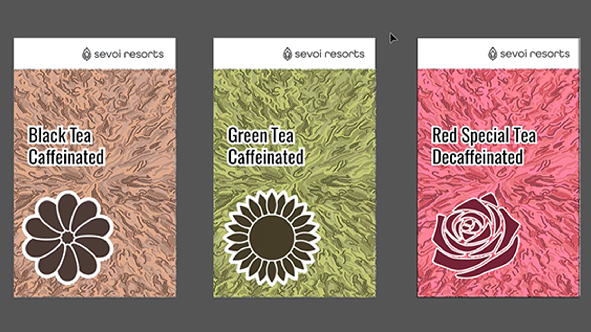

# Översikt över Adobe [!DNL Firefly]

Firefly är den nya familjen av generativa AI-modeller för kreatörer som kommer till Adobe-produkter. De fokuserar i första hand på bild- och texteffektgenerering. I Firefly finns nya sätt att tänka, skapa och kommunicera, samtidigt som det ger en avsevärd förbättring av arbetsflödet.

## Se vad du kan göra med Adobe Firefly

  

>[!VIDEO](https://video.tv.adobe.com/v/3416970t1?quality=12&learn=on&hidetitle=true)

## Självstudiekurser om Firefly

<table style="table-layout:fixed">
<tr>
   <td>
      
   </td>
   <td>
      
   </td>
   <td>
      
   </td>
   <td>
      
   </td>
</tr>
<tr>
  <td>
      
   </td>
   <td>
      
   </td>
   <td>
      
   </td>
    <td>
      
   </td>
</tr>
<tr>
 <td>
      
   </td>
   <td>
      
   </td>
   <td>
      
   </td>
   <td>
      
   </td>
</tr>
<tr>
  <td>
      
   </td>
  <td>
      
   </td>
  <td>
      
  </td>
  <td>
      
   </td>
</table>
