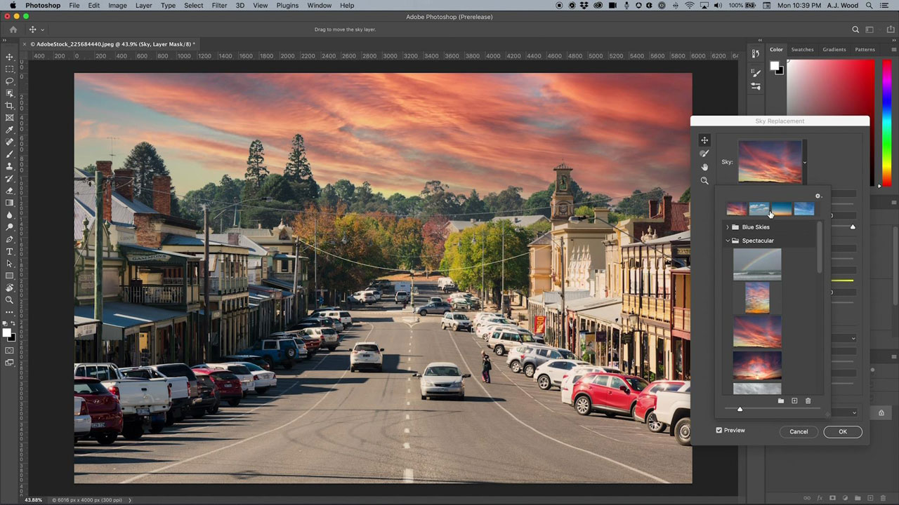

# Photoshop

Photoshop är världens bästa bildbehandlings- och grafikdesignprogram. Det ger proffsen obegränsad kreativitet på alla enheter. Nu kan vem som helst skapa vad som helst som de föreställer sig, var som helst och när som helst. Om du kan tro det, kan du göra det med Photoshop.

## Bläddra i Tutorials

<table style="table-layout:fixed">
<tr>
 <td>
   
    

   <a href="photoshop.md#tutorial1"><strong>Redigera bilder så att de matchar din kampanj</strong></a>
    

    <em>Använd de kraftfulla markerings- och färgredigeringsverktygen i Adobe Photoshop för att dramatiskt ändra en bild som passar ditt företags varumärkesbehov</em>
     
  </td>
  <td>
    
    

    <a href="photoshop.md#tutorial2"><strong>Markera och ersätt himlen</strong></a>
    

    <em>Markera himlen i en bild automatiskt och ersätt den med en valfri himmel genom att justera färgerna i bilden automatiskt så att de matchar markeringen</em>
     
  </td>
  <td>
    
    

     
  </td>
</tr>
</table>

## Redigera bilder för att matcha din kampanj (5:45) {#tutorial1}

>[!VIDEO](https://video.tv.adobe.com/v/326950?hidetitle=true)

**Beskrivning**
Använd de kraftfulla markerings- och färgredigeringsverktygen i Adobe Photoshop för att dramatiskt ändra en bild så att den passar ditt företags varumärkesbehov.

I den här självstudiekursen får du lära dig hur:
* Med objektmarkeringsverktyget kan du markera objekt både snabbare och enklare
* Innehållsanpassad fyllning ger mer kontroll över provområdena i en källbild, vilket ger bättre kloning och lagning av målområden
* Penslar kan ha olika former för bättre resultat
* Adobe AI utnyttjar artificiell intelligens för vardagliga uppgifter

**Presenteras av:**
A.J Wood, Senior Solutions Consultant (Digital Media)

## Markera och ersätt himlen (2:16) {#tutorial2}

>[!VIDEO](https://video.tv.adobe.com/v/326953?hidetitle=true)

**Beskrivning**
Markera himlen i en bild automatiskt och ersätt den med en valfri himmel. Ändra bildens färger automatiskt så att de matchar ditt val.

I den här självstudiekursen får du lära dig mer om att:
* Ersätt himmel är en enklickslösning för att omedelbart byta himmel i dina bilder
* Ersätt himmel sparar utdata som en lagergrupp med varje mask, justering och bild för ytterligare förfining

**Presenteras av:**
A.J Wood, Senior Solutions Consultant (Digital Media)

**Photoshop-resurser**

[Utbildning och support](https://helpx.adobe.com/se/support/photoshop.html) är navet för ytterligare självstudiekurser, [Nyheter](https://helpx.adobe.com/se/photoshop/using/whats-new.html) och länkar till communityforum.

**Oktober 2020-utgåvan**

Börja använda dessa funktioner (och mycket mer!) genom att hämta den senaste uppdateringen från Creative Cloud-datorprogrammet.
