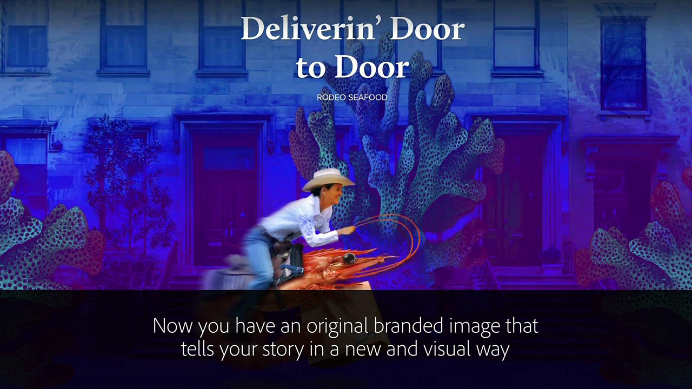
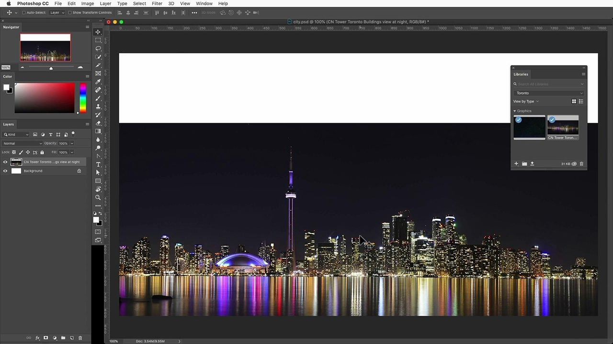
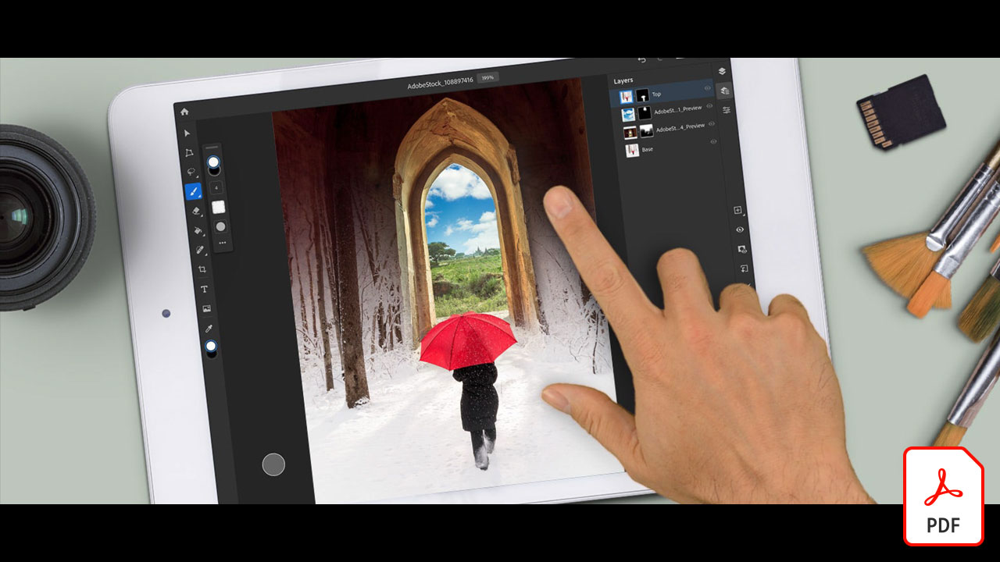
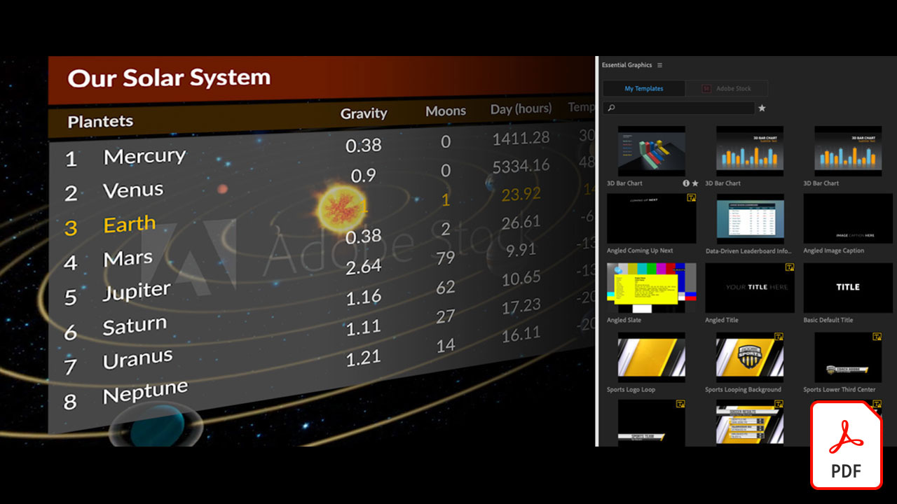
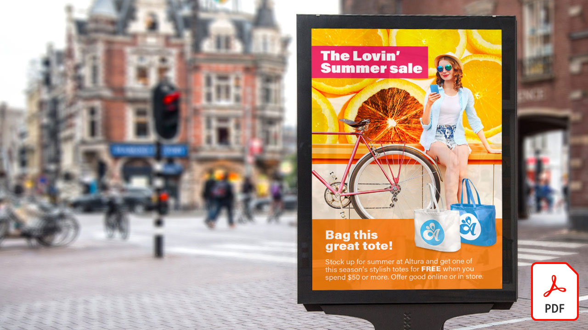

# Självstudiekurser för Adobe [!DNL Stock]

Kreatörer pressas att snabbt leverera engagerande visuellt innehåll. Adobe Stock ger de kreativa teamen tillgång till fler än 300 miljoner royaltyfria bilder, videor, ljudfiler, mallar, illustrationer och 3D-mediefiler - direkt i de Creative Cloud-program de använder dagligen. Få obegränsad tillgång till Adobe Stock-standardresurser med Creative Cloud Pro Edition. Utforska de senaste samlingarna på stock.adobe.com. Välj en bild för att se en självstudiekurs.

<table>
<tr>
   <td>
      
      

      <a href="stunning-digital-assets.md"><strong>Fantastiska digitala resurser (PDF)</strong></a>
      

      <em>Lär dig integrera Adobe Stock med CC Libraries för att skapa konsekventa och professionella designresultat för tryck och skärmar i den här praktiska självstudiekursen</em>
       
  </td>
  <td>
      
      

      <a href="searchstock.md"><strong>Sök i Adobe [!DNL Stock] licensieringshistorik</strong></a>
      

      <em>Lär dig söka snabbt i organisationens Adobe [!DNL Stock]-licenshistorik i Creative Cloud för företag</em>
       
  </td>
  <td>
      
      

      <a href="handdrawn.md"><strong>Lägg till en handritad estetik i Adobe [!DNL Stock]-foton</strong></a>
      

      <em>Förstärk din kreativa marknadsföring med unika tekniker som ger dina bilder djup och dimension med Photoshop för iPad</em>
       
  </td>
  <td>
   
    

   <a href="flairtypography.md"><strong>Få typografi att se mer levande ut med masker och animeringar</strong></a>
    

    <em>Gör din text mer levande med element från Adobe [!DNL Stock] och animeringsstilar från After Effects</em>
     
  </td>
</tr>
<tr>
  <td>
      
      

      <a href="animatevector.md"><strong>Animera en [!DNL Stock]-vektorillustration från Adobe i Photoshop</strong></a>
      

      <em>Få animering i nyhetsbrevets grafik med redigerbara vektorer för Adobe [!DNL Stock]</em>
       
  </td>
 <td>
      
      

      <a href="annualreport.md"><strong>Börja din årsrapport med en video som har skapats med Adobe [!DNL Stock] och Spark Video</strong></a>
      

      <em>Gör din årsrapport till en story med Adobe [!DNL Stock] och Spark Video</em>
       
  </td>
  <td>
      
      

      <a href="customanimations.md"><strong>Väck kreativiteten till liv med anpassade animeringar från Adobe [!DNL Stock]</strong></a>
      

      <em>Använd Adobe [!DNL Stock]-bilder, texturer och mönster i anpassade animeringar i Photoshop</em>
       
  </td>
  <td>
      
      

      <a href="changecolors.md"><strong>Ändra en Adobe [!DNL Stock]-bilds färger så att de matchar din berättelse</strong></a>
      

      <em>Hitta ett unikt foto i Adobe [!DNL Stock] och anpassa sedan färgerna i Adobe Photoshop efter dina behov</em>
       
  </td>
</tr>
<tr>
 <td>
      
      

      <a href="collage.md"><strong>Skapa ett 3D-kollage för en affisch med Adobe [!DNL Stock]-foton</strong></a>
      

      <em>Designa ett kollage i Adobe Illustrator med en iögonfallande 3D-effekt från foton i Adobe [!DNL Stock]</em>
       
  </td>
  <td>
      
      

      <a href="boldlabel.md"><strong>Skapa en fet etikett med Adobe [!DNL Stock]-mallar och Photoshop smarta objekt</strong></a>
      

      <em>Designa och visualisera dina anpassade designer med realistiska förpackningsmallar från Adobe [!DNL Stock]</em>
       
  </td>
  <td>
      
      

      <a href="infographic.md"><strong>Skapa en infografik för riktlinjer för företaget med Adobe [!DNL Stock]</strong></a>
      

      <em>Kombinera olika mediefiler från Adobe [!DNL Stock] för att förmedla riktlinjer i form av visuell infografik</em>
       
  </td>
 <td>
      
      

      <a href="featurecomparison.md"><strong>Skapa ett diagram för produktjämförelse med Adobe [!DNL Stock]</strong></a>
      

      <em>Skapa grafik som jämför produktprisplaner för att ge potentiella kunder den information de behöver snabbt</em>
       
  </td>
</tr>
<tr>
   <td>
      
      

      <a href="surrealcomposite.md"><strong>Skapa en halvsurrealistisk sammansättning med Adobe [!DNL Stock]</strong></a>
      

      <em>Skapa en minnesvärd redaktionell bild genom att kombinera flera bilder med färg, rörelse och maskeringseffekter</em>
       
  </td>
   <td>
      
      

      <a href="surrealpattern.md"><strong>Skapa ett halvsurrealistiskt mönster med Adobe [!DNL Stock]</strong></a>
      

      <em>Skapa ett snyggt och sömlöst mönster baserat på surrealistiska bilder från Adobe [!DNL Stock]</em>
       
  </td>
   <td>
      
      

      <a href="productconfigurator.md"><strong>Skapa en interaktiv produktkonfigurator med Adobe [!DNL Stock]</strong></a>
      

      <em>Visa ekonomisk information på ett visuellt sätt med hjälp av interaktivitet, animering och redigerbara bilder från Adobe [!DNL Stock]</em>
       
  </td>
  <td>
      
      

      <a href="interactivetourismphoto.md"><strong>Skapa ett interaktivt turistfoto med Adobe [!DNL Stock] och XD</strong></a>
      

      <em>Skapa snabbt ett interaktivt foto med prototypen för din webbplats med Adobe [!DNL Stock] och XD</em>
       
  </td>
</tr>
<tr>
 <td>
      
      

      <a href="animationemail.md"><strong>Skapa animeringar för e-post med Adobe [!DNL Stock] och Photoshop</strong></a>
      

      <em>Skapa e-post med stop-action-animering med Adobe [!DNL Stock] och Photoshop</em>
       
  </td>
  <td>
      
      

      <a href="brandgradients.md"><strong>Skapa sammanhängande varumärkesbilder med snygga övertoningar och resurser från Adobe [!DNL Stock]</strong></a>
      

      <em>Skapa varumärkesidentitet med olika bilder genom att kombinera färger och övertoningar i hela din reklamkampanj</em>
       
   </td>
  <td>
      
      

      <a href="webgraphics.md"><strong>Skapa engagerande webbgrafik genom att kombinera Adobe [!DNL Stock]-bilder med CSS</strong></a>
      

      <em>Skapa varumärkesidentitet med olika bilder genom att kombinera färger och övertoningar i hela din reklamkampanj</em>
       
  </td>
  <td>
      
      

      <a href="moodboard.md"><strong>Skapa inspirerande moodboards på nolltid med Adobe [!DNL Stock]</strong></a>
      

      <em>Skapa en projektstämningsöversikt för att förmedla information, idéer, bilder och färgpaletter till team/kunder</em>
       
  </td>
</tr>
<tr>
   <td>
      
      

      <a href="realisticcomposite.md"><strong>Skapa realistiska fotokompositioner med Adobe [!DNL Stock]-foton</strong></a>
      

      <em>Samla två fantastiska [!DNL Stock]-foton från Adobe för att locka folk till dina inlägg i sociala medier</em>
       
  </td>
   <td>
   
    

   <a href="loadingscreen.md"><strong>Anpassa en inläsningsskärmanimering med Adobe [!DNL Stock] och XD</strong></a>
    

    <em>Anpassa vektorgrafik från Adobe [!DNL Stock] för att skapa en spännande skärmanimering för en mobilapp</em>
     
  </td>
  <td>
   
    

   <a href="presentationtemplate.md"><strong>Anpassa en presentationsmall för Adobe [!DNL Stock] så att den ser professionell ut men ändå iögonfallande</strong></a>
    

    <em>Skapa snygga, stiliserade foton och mallar från Adobe [!DNL Stock] och några lättanvända specialeffekter</em>
     
  </td>
   <td>
   
    

   <a href="customizecolors.md"><strong>Anpassa färgerna i en [!DNL Stock]-vektorillustration i Adobe</strong></a>
    

    <em>Få dina projekt att se snygga ut med en snygg illustration. Hitta den perfekta vektorbilden i Adobe [!DNL Stock] och matcha sedan färgerna med projektets palett med Adobe Illustrator</em>
     
  </td>
</tr>
<tr>
   <td>
      
      

      <a href="assets/AddMotiontoStillImageswithAdobeStockandPhotoshop.pdf"><strong>Lägg till rörelse i stillbilder med Adobe [!DNL Stock] och Photoshop (PDF)</strong></a>
      

      <em>Imponera på dina målgrupper på vilken skärm som helst genom att införliva video i en stillbild</em>
       
   </td>
   <td>
   
    

   <a href="assets/CreateacompositewithPhotoshopontheiPadandAdobeStockimages.pdf" target="_blank"><strong>Skapa en sammansatt bild med Photoshop på iPad och Adobe [!DNL Stock] (PDF)</strong></a>
    

    <em>Lär dig använda ett av dina Adobe Creative Cloud-favoritprogram på ett helt nytt sätt med hjälp av Photoshop på din iPad</em>
     
  </td>
   <td>
   
    

   <a href="assets/CreateaUniqueEditorialGraphicwithAfterEffectsandAdobeStock.pdf" target="_blank"><strong>Animera en [!DNL Stock]-vektorillustration från Adobe i Photoshop (PDF)</strong></a>
    

    <em>Genom att kombinera After Effects med Adobe [!DNL Stock] kan du snabbt skapa fantastiska specialeffekter som hjälper dig att berätta en historia visuellt</em>
     
  </td>
   <td>
      
      

      <a href="assets/CreateUniqueGraphicsbyCombiningAdobeStockImages.pdf" target="_blank"><strong>Skapa unik grafik genom att kombinera Adobe [!DNL Stock]-bilder (PDF)</strong></a>
      

      <em>Samla två olika bilder för att skapa en helt ny scen för dina designprojekt. Adobe [!DNL Stock] och Adobe Photoshop gör det enkelt</em>
       
   </td>
</tr>
<tr>
  <td>
      
      

      <a href="assets/CreatingaHalloweenCinemagraphwithPhotoshopCCandAdobeStock.pdf" target="_blank"><strong>Skapa ett Halloweenfilmklipp med Photoshop CC och Adobe [!DNL Stock] (PDF)</strong></a>
      

      <em>Skapa ett biografdiagram genom att sätta samman video, illustrationer och foton med Adobe Photoshop</em>
       
  </td>
   <td>
      
      

      <a href="assets/PutyourDatainMotionwithAdobeStockandPremierePro.pdf" target="_blank"><strong>Få igång dina data med Adobe [!DNL Stock] och Premiere Pro (PDF)</strong></a>
      

      <em>Väck liv i dina data och berätta en mer övertygande historia med hjälp av Adobe [!DNL Stock] och Adobe Premiere Pro</em>
       
  </td>
   <td>
      
      

      <a href="assets/RecolorAdobeStockVectorArtworkwithAdobeIllustratortoGetExactlytheLookYouWant.pdf" target="_blank"><strong>Ändra färg på vektorkonstverk i Adobe [!DNL Stock] med Adobe Illustrator för att få exakt det utseende du vill ha (PDF)</strong></a>
      

      <em>Adobe [!DNL Stock] gör det enkelt att hitta unik vektorgrafik, och med Adobe Illustrator kan du snabbt ändra den så att den matchar din kreativa vision</em>
       
   </td>
   <td>
      
      

      <a href="assets/ShowOffyourDesignWorkintheRealWorldwithAdobeStockandPhotoshop.pdf" target="_blank"><strong>Visa upp ditt designarbete i verkligheten med Adobe [!DNL Stock] och Photoshop (PDF)</strong></a>
      

      <em>Följ de här stegen för att visa upp det du har gjort i en realistisk Adobe [!DNL Stock]-mall med Adobe Photoshop</em>
       
  </td>
 </tr> 
 <tr>
   <td>
      
      

      <a href="assets/UncoveramazingdetailsinAdobeStockimageswithLightroomformobile.pdf" target="_blank"><strong>Upptäck fantastiska detaljer i Adobe [!DNL Stock] med Lightroom for mobile (PDF)</strong></a>
      

      <em>Upptäck fördelarna med Lightroom på din mobila enhet för att få ut det bästa av dina bilder</em>
       
  </td>
  <td>
      
      

      <a href="assets/VisualizePosterDesignsintheRealWorldwithAdobeStockandPhotoshop.pdf" target="_blank"><strong>Visualisera affischdesign i verkligheten med Adobe [!DNL Stock] och Photoshop (PDF)</strong></a>
      

      <em>Visa upp din design i verkliga miljöer och få en bättre känsla för hur den ser ut i verkligheten</em>
       
  </td>
  <td>
    
    

     
  </td>
</tr>
</table>
